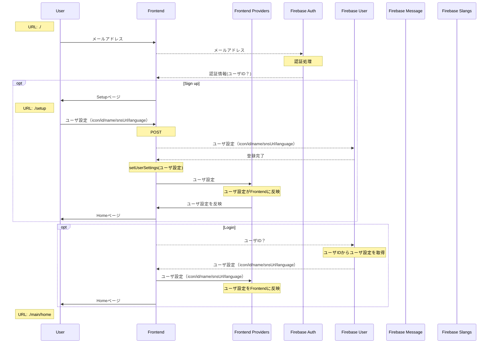
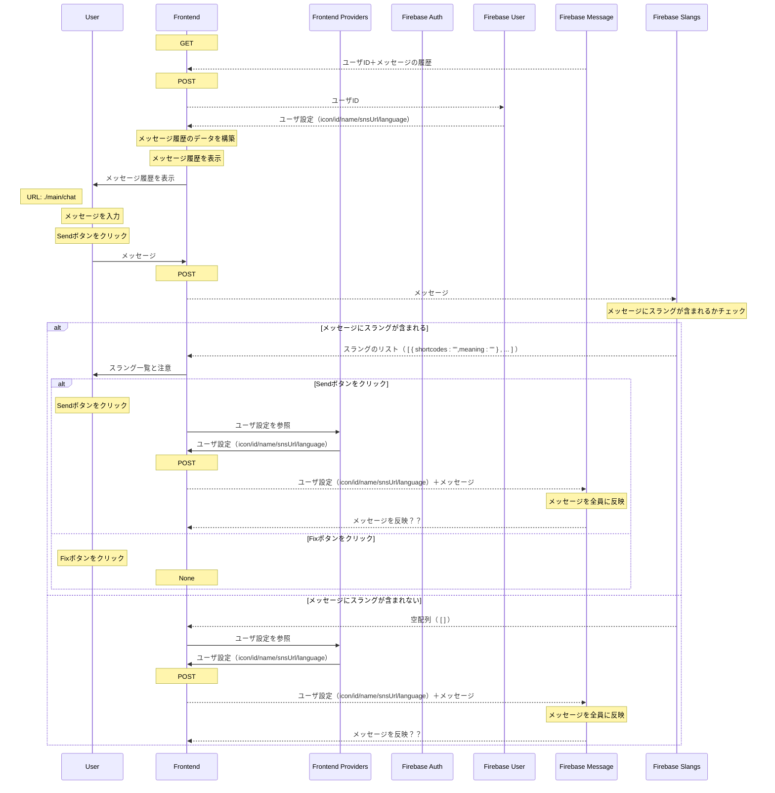
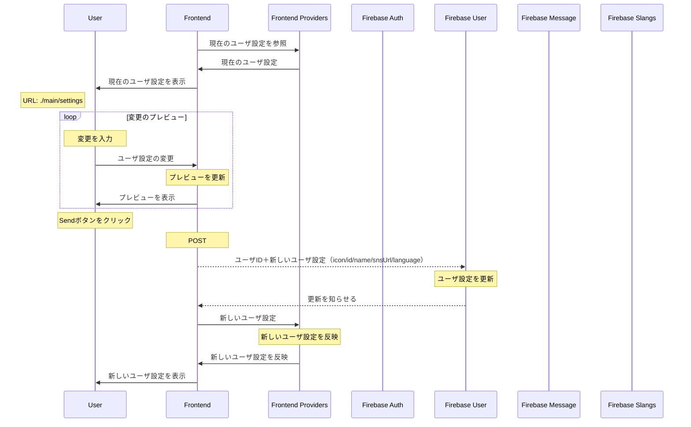

# emocha - frontend

## File Structure Overview

```
frontend/
    ├ public/
    |   ├ navIcon/    # ナビゲーションで使用するアイコン
    |   ├ favion.ico
    |   ├ index.html
    |   ├ manifest.json
    |   └ robots.txt
    |
    ├ src/
    |   ├ components/
    |   |   ├ api/    # Python ( FastAPI )との通信
    |   |   |
    |   |   ├ main/    # 画面を構成するコンポーネントを格納するフォルダ
    |   |   |   ├ chat/    # Chatページで使用するコンポーネント
    |   |   |   |   └ parts/    # Chatページで使用するパーツ
    |   |   |   |
    |   |   |   ├ globalParts/    # 複数のページで使用されるコンポーネント
    |   |   |   |
    |   |   |   ├ slangs/    # スラングを取得するコンポーネント（バックエンドと連携予定）
    |   |   |   |
    |   |   |   └ nav/    # ナビゲーションを表示するコンポーネント
    |   |   |
    |   |   ├ providers/    # プロバイダー（グローバル値）を保存
    |   |   |
    |   |   ├ router/    # URLなどのルーター設定
    |   |   |
    |   |   └ socketio/    # socket.ioでの通信
    |   |
    |   ├ pages/    # 表示するページのレイアウト
    |   |
    |   ├ App.css    # Twemojiの大きさを定義
    |   ├ App.jsx    # Rooterを呼び出してページを表示
    |   ├ index.css    # Tailwind CSSを反映
    |   └ index.js    # Providerの呼び出し
    |   
    ├ .gitignore
    ├ package-lock.json
    ├ package.json
    └ tailwind.config.js    # Tailwind CSSの設定
```

## Sequence Diagram
### Auth ~ Home


### Chat



### Change Settings

